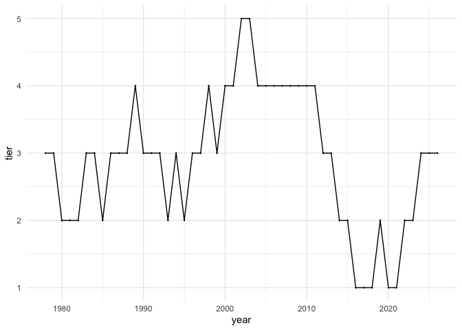

# FixCollegeFootball


College football needs a new structure. I propose a system that divides
all FBS teams into three geographic regions (East, Central, and West),
each operating as a self-contained relegation and promotion ecosystem.
Within each region, teams are organized into tiered conferences of eight
teams, forming a ladder-style hierarchy. For example, Tier 1 contains
the top eight teams within a region, Tier 2 the next eight, and so on.

During the regular season, teams play a round-robin schedule against
others in their conference. At the end of the season, the
highest-finishing teams in each conference earn the opportunity to
challenge the lowest-finishing teams in the conference one tier above.
These promotion and relegation matchups create meaningful postseason
play for nearly every team, not just those competing for a national
title.

The remainder of each team’s schedule is filled with three rivalry games
and two inter-regional matchups against teams in the same tier. A
12-team playoff determines the national champion, with automatic bids
awarded to the top three teams in Tier 1 of each region. This structure
guarantees representation from each region and rewards sustained success
while preserving at-large flexibility. I further explain and and
motivate this system in [this article](college_football_relegation_system.pdf).

In this Github Repository, I implement the proposed system through
simulation beginning with the 1978 season, aligning with the start of
the modern era of college football. Each simulation requires predefined
region assignments for each team, rivalry game preferences, and [SP+
ratings](https://collegefootballdata.com/sp/trends) - a widely used
efficiency-based rating system developed by Bill Connelly. Users are
encouraged to fork this repository, modify the region assignments or
rivalry game preferences and run their own simulations. While the full
mechanics are executed in the simulation_workflow folder, running
example_simulation.R will generate a complete simulation from start to
finish. Because the system includes many stochastic elements, results
vary across runs. Outputs printed below are drawn from one such
simulation:

``` r
source("simulation_world/simulation_workflow/summarize_results.R")

# load simulation specified in example_simulation.R
results_list <- readRDS(
  file = "simulation_world/data/example_results.rds"
)
```

## CFP Champions

``` r
# print cfp champions
cfp_champs(results_list)$year_by_year |> print(n = 48)
```

    ## # A tibble: 48 × 3
    ##    winner            runner_up       year
    ##    <chr>             <chr>          <dbl>
    ##  1 Indiana           Texas Tech      2025
    ##  2 Ole Miss          Ohio State      2024
    ##  3 Michigan          Georgia         2023
    ##  4 Michigan          Texas           2022
    ##  5 Oklahoma State    Clemson         2021
    ##  6 Oregon            Wisconsin       2020
    ##  7 Alabama           Ohio State      2019
    ##  8 Mississippi State Alabama         2018
    ##  9 Alabama           Ohio State      2017
    ## 10 Alabama           Clemson         2016
    ## 11 Ohio State        Notre Dame      2015
    ## 12 Alabama           Florida State   2014
    ## 13 Alabama           Oregon          2013
    ## 14 Alabama           USC             2012
    ## 15 Alabama           Oklahoma        2011
    ## 16 Oregon            Oklahoma State  2010
    ## 17 Texas             Florida         2009
    ## 18 Penn State        USC             2008
    ## 19 West Virginia     Georgia         2007
    ## 20 Louisville        LSU             2006
    ## 21 Texas             LSU             2005
    ## 22 Auburn            Louisville      2004
    ## 23 LSU               Kansas State    2003
    ## 24 Miami             USC             2002
    ## 25 Colorado          Oklahoma        2001
    ## 26 Virginia Tech     Florida         2000
    ## 27 Florida State     Virginia Tech   1999
    ## 28 Nebraska          Florida State   1998
    ## 29 Florida State     Syracuse        1997
    ## 30 Florida           Texas           1996
    ## 31 Nebraska          Notre Dame      1995
    ## 32 Michigan          Colorado        1994
    ## 33 Nebraska          UCLA            1993
    ## 34 Georgia           Alabama         1992
    ## 35 Florida           Texas A&M       1991
    ## 36 Tennessee         Miami           1990
    ## 37 Notre Dame        Florida State   1989
    ## 38 Florida State     USC             1988
    ## 39 UCLA              Nebraska        1987
    ## 40 Alabama           Oklahoma        1986
    ## 41 Michigan          Oklahoma        1985
    ## 42 Boston College    Ohio State      1984
    ## 43 BYU               Georgia         1983
    ## 44 Arizona State     Pittsburgh      1982
    ## 45 Pittsburgh        North Carolina  1981
    ## 46 USC               Alabama         1980
    ## 47 USC               UCLA            1979
    ## 48 Alabama           Oklahoma        1978

``` r
cfp_champs(results_list)$champs_total |> print(n= 30)
```

    ## # A tibble: 29 × 3
    ##    winner            championships most_recent
    ##    <chr>                     <int>       <dbl>
    ##  1 Alabama                       9        2019
    ##  2 Michigan                      4        2023
    ##  3 Florida State                 3        1999
    ##  4 Nebraska                      3        1998
    ##  5 Florida                       2        1996
    ##  6 Oregon                        2        2020
    ##  7 Texas                         2        2009
    ##  8 USC                           2        1980
    ##  9 Arizona State                 1        1982
    ## 10 Auburn                        1        2004
    ## 11 BYU                           1        1983
    ## 12 Boston College                1        1984
    ## 13 Colorado                      1        2001
    ## 14 Georgia                       1        1992
    ## 15 Indiana                       1        2025
    ## 16 LSU                           1        2003
    ## 17 Louisville                    1        2006
    ## 18 Miami                         1        2002
    ## 19 Mississippi State             1        2018
    ## 20 Notre Dame                    1        1989
    ## 21 Ohio State                    1        2015
    ## 22 Oklahoma State                1        2021
    ## 23 Ole Miss                      1        2024
    ## 24 Penn State                    1        2008
    ## 25 Pittsburgh                    1        1981
    ## 26 Tennessee                     1        1990
    ## 27 UCLA                          1        1987
    ## 28 Virginia Tech                 1        2000
    ## 29 West Virginia                 1        2007

## Playoff Appearances

``` r
# print teams by playoff appearances
playoff_app(results_list) |> print(n=50)
```

    ## # A tibble: 69 × 6
    ##    team              appearances round_2 semis finals championships
    ##    <chr>                   <int>   <int> <int>  <int>         <int>
    ##  1 Alabama                    29      24    17     12             9
    ##  2 Michigan                   26      19    11      4             4
    ##  3 Florida State              28      25    13      6             3
    ##  4 Nebraska                   21      16     9      4             3
    ##  5 USC                        21      14    12      6             2
    ##  6 Texas                      14      13     8      4             2
    ##  7 Florida                    21      15     7      4             2
    ##  8 Oregon                     13       9     3      3             2
    ##  9 Ohio State                 31      23    13      5             1
    ## 10 Georgia                    20      11     6      4             1
    ## 11 Notre Dame                 21      14     6      3             1
    ## 12 LSU                        10       7     4      3             1
    ## 13 UCLA                       15       6     4      3             1
    ## 14 Miami                      17      13     7      2             1
    ## 15 Virginia Tech              11       5     4      2             1
    ## 16 Pittsburgh                  6       5     4      2             1
    ## 17 Louisville                  6       3     3      2             1
    ## 18 Colorado                    5       4     2      2             1
    ## 19 Oklahoma State              3       2     2      2             1
    ## 20 Penn State                 24      18     6      1             1
    ## 21 Auburn                     14      12     6      1             1
    ## 22 Tennessee                  13      10     4      1             1
    ## 23 Arizona State               8       5     1      1             1
    ## 24 West Virginia               6       3     1      1             1
    ## 25 Boston College              5       3     1      1             1
    ## 26 BYU                         4       3     1      1             1
    ## 27 Mississippi State           4       3     1      1             1
    ## 28 Ole Miss                    3       2     1      1             1
    ## 29 Indiana                     1       1     1      1             1
    ## 30 Oklahoma                   27      18     7      5             0
    ## 31 Clemson                    11       7     4      2             0
    ## 32 Texas A&M                  10       6     2      1             0
    ## 33 North Carolina              5       3     2      1             0
    ## 34 Wisconsin                   9       5     1      1             0
    ## 35 Kansas State                7       4     1      1             0
    ## 36 Texas Tech                  5       3     1      1             0
    ## 37 Syracuse                    4       3     1      1             0
    ## 38 Washington                 15      10     2      0             0
    ## 39 Arizona                     5       3     2      0             0
    ## 40 TCU                         6       3     1      0             0
    ## 41 Maryland                    5       3     1      0             0
    ## 42 Boise State                 4       3     1      0             0
    ## 43 Baylor                      4       2     1      0             0
    ## 44 Houston                     4       2     1      0             0
    ## 45 Stanford                    2       2     1      0             0
    ## 46 Wyoming                     2       2     1      0             0
    ## 47 Missouri                    5       1     1      0             0
    ## 48 California                  2       1     1      0             0
    ## 49 Purdue                      2       1     1      0             0
    ## 50 James Madison               1       1     1      0             0
    ## # ℹ 19 more rows

## Tier Journey - Baylor University

``` r
tier_journey(results_list, "Baylor", interactive = FALSE)
```

<!-- -->

## Win Percentage - Baylor University

``` r
win_percentage(results_list, "Baylor")
```

    ## $opponents
    ## # A tibble: 95 × 4
    ##    opponent          wins losses games
    ##    <chr>            <dbl>  <int> <int>
    ##  1 Texas Tech          19     20    39
    ##  2 Texas               10     28    38
    ##  3 TCU                 18     17    35
    ##  4 Texas A&M           14     20    34
    ##  5 Houston             14     13    27
    ##  6 SMU                 10     12    22
    ##  7 Oklahoma State       3     13    16
    ##  8 San José State      11      4    15
    ##  9 Washington State    10      5    15
    ## 10 Tulsa               10      4    14
    ## # ℹ 85 more rows
    ## 
    ## $game_type
    ## # A tibble: 10 × 4
    ##    type                  wins losses games
    ##    <chr>                <dbl>  <int> <int>
    ##  1 conference             169    167   336
    ##  2 rivalry                 58     84   142
    ##  3 inter-region            54     33    87
    ##  4 relegation-defend       11      9    20
    ##  5 relegation-challenge     9     10    19
    ##  6 makeup                   8      3    11
    ##  7 consolation              2      3     5
    ##  8 cfp-1R                   2      2     4
    ##  9 cfp-2R                   1      1     2
    ## 10 cfp-SF                   0      1     1
    ## 
    ## $year
    ## # A tibble: 48 × 6
    ##     year region  tier  wins losses games
    ##    <dbl> <chr>  <dbl> <dbl>  <int> <int>
    ##  1  1978 west       3     7      6    13
    ##  2  1979 west       3    10      3    13
    ##  3  1980 west       1     7      6    13
    ##  4  1981 west       2     7      6    13
    ##  5  1982 west       3     5      8    13
    ##  6  1983 west       3     9      4    13
    ##  7  1984 west       3     8      5    13
    ##  8  1985 west       2     9      4    13
    ##  9  1986 west       1     3     10    13
    ## 10  1987 west       2     1     12    13
    ## # ℹ 38 more rows
    ## 
    ## $tier
    ## # A tibble: 5 × 5
    ## # Groups:   region, tier [5]
    ##   region  tier  wins losses games
    ##   <chr>  <dbl> <dbl>  <int> <int>
    ## 1 west       1    54     53   107
    ## 2 west       2    39     65   104
    ## 3 west       3   140     94   234
    ## 4 west       4    35     30    65
    ## 5 west       5    46     71   117

# 100 Simulations:

I simulate the 40+ years of college football history 100 times and
display some of the summarized results:

``` r
average_results <- read_csv("simulation_world/data/average_results.csv", show_col_types = FALSE)

average_results |> print(n=60)
```

    ## # A tibble: 165 × 12
    ##    team       seasons championships finals semis round_2 appearances average_tier win_percentage games  wins losses
    ##    <chr>        <dbl>         <dbl>  <dbl> <dbl>   <dbl>       <dbl>        <dbl>          <dbl> <dbl> <dbl>  <dbl>
    ##  1 Alabama         48          4.6    7.83 13.8    21.8        26.7          1.18          0.655  653.  428.   225.
    ##  2 Florida S…      48          4.5    7.65 12.9    20.8        24.9          1.37          0.648  652.  422.   229.
    ##  3 Ohio State      48          3.45   6.67 12.1    21.5        29.2          1.12          0.669  653.  437.   216.
    ##  4 Miami           48          3.1    5.26  9.33   15.7        19.9          1.41          0.618  645.  399.   246.
    ##  5 Florida         48          2.93   5.53  9.97   16.6        21.0          1.29          0.603  646.  390.   256.
    ##  6 USC             48          2.82   4.85  8.63   15.2        20.9          1.30          0.615  644.  396.   248 
    ##  7 Nebraska        48          2.76   5.16  9.67   16.3        20.8          1.50          0.627  645.  405.   241.
    ##  8 Georgia         48          2.38   4.55  8.27   15.1        20.7          1.28          0.602  644.  387.   256.
    ##  9 Oklahoma        48          2.03   4.27  9.41   18.1        24.8          1.32          0.636  647.  412.   235.
    ## 10 Penn State      48          1.8    3.84  7.57   14.9        22.0          1.26          0.614  643.  395.   248.
    ## 11 Michigan        48          1.7    3.56  7.25   15.3        23.6          1.19          0.630  644.  405.   238.
    ## 12 Texas           48          1.39   2.75  5.44   10.4        14.9          1.56          0.578  637.  369.   269.
    ## 13 LSU             48          1.33   2.84  5.41   10.2        15.0          1.43          0.555  637.  353.   283.
    ## 14 Notre Dame      48          1.21   2.74  6.04   13.0        20.4          1.28          0.606  640.  387.   252.
    ## 15 Washington      48          0.93   1.88  3.88    7.94       12.0          1.86          0.570  634.  361.   273.
    ## 16 Clemson         48          0.81   1.9   4.04    8.41       12.0          1.58          0.575  634.  365.   270.
    ## 17 Auburn          48          0.78   1.84  4.11    9.09       13.2          1.49          0.555  634.  352.   282.
    ## 18 Tennessee       48          0.74   1.77  3.97    8.03       12.3          1.54          0.559  634.  355.   279.
    ## 19 Oregon          48          0.7    1.74  3.95    8.13       11.4          2.13          0.592  634.  375.   259.
    ## 20 Kansas St…      48          0.55   1.11  2.28    5.17        8.24         2.68          0.524  630.  330.   300.
    ## 21 Pittsburgh      48          0.54   0.96  1.8     3.54        5.51         2.10          0.514  628.  323.   306.
    ## 22 UCLA            48          0.53   1.43  2.89    6.03        9.21         1.91          0.534  631.  337.   294.
    ## 23 Virginia …      48          0.45   0.92  2.39    5.68        9.96         1.94          0.529  631.  333.   297.
    ## 24 Texas A&M       48          0.44   1.2   2.91    7.41       12.7          1.61          0.553  633.  350.   283.
    ## 25 Ole Miss        48          0.44   0.74  1.54    2.94        4.28         2.09          0.479  627.  301.   327.
    ## 26 Colorado        48          0.41   0.84  1.93    4.15        6.14         2.80          0.488  629.  307.   322.
    ## 27 Wisconsin       48          0.4    0.93  2.51    5.86        9.77         2.22          0.539  631.  340.   291.
    ## 28 BYU             48          0.37   0.83  1.94    4.31        6.79         2.05          0.580  629.  365.   264.
    ## 29 Oklahoma …      48          0.37   0.77  1.68    3.85        6.28         2.32          0.520  628.  327.   302.
    ## 30 Stanford        48          0.31   0.62  1.39    3.27        5.04         2.42          0.481  628.  302.   326.
    ## 31 West Virg…      48          0.26   0.62  1.27    3.26        6.01         1.89          0.507  628.  318.   310.
    ## 32 Arkansas        48          0.22   0.64  1.56    4.49        8.54         1.69          0.508  629   320.   309.
    ## 33 Texas Tech      48          0.22   0.48  1.15    2.92        4.93         2.30          0.529  627.  332.   295.
    ## 34 Arizona S…      48          0.21   0.59  1.27    2.94        4.98         2.08          0.534  627.  335.   293.
    ## 35 Indiana         48          0.19   0.36  0.56    1.04        1.52         3.44          0.504  625.  315.   310.
    ## 36 Boise Sta…      30          0.16   0.38  0.72    1.84        3.23         2.53          0.587  390.  229.   161.
    ## 37 TCU             48          0.16   0.37  0.88    2.35        3.96         3.16          0.527  627.  330.   296.
    ## 38 North Car…      48          0.16   0.37  0.81    2.22        3.97         2.11          0.513  626.  321.   305.
    ## 39 Iowa            48          0.14   0.41  1.25    3.93        7.61         1.98          0.571  628.  359.   270.
    ## 40 Michigan …      48          0.14   0.3   0.89    2.69        5.66         1.94          0.488  627.  306.   321.
    ## 41 California      48          0.12   0.33  0.65    1.4         2.45         2.76          0.480  626.  300.   325.
    ## 42 South Car…      48          0.12   0.28  0.77    2.24        3.81         1.97          0.503  626.  315.   311.
    ## 43 Missouri        48          0.09   0.32  0.89    2.8         5.81         2.15          0.514  627.  323.   304.
    ## 44 Louisville      48          0.09   0.3   0.85    2.31        4.18         2.76          0.511  626.  320.   307.
    ## 45 Boston Co…      48          0.09   0.28  0.58    1.48        2.96         2.52          0.484  626.  303.   323.
    ## 46 Utah            48          0.08   0.26  0.69    1.9         3.88         2.62          0.546  626.  342.   284.
    ## 47 Houston         48          0.07   0.22  0.65    1.36        2.22         3.14          0.509  626.  318.   307.
    ## 48 Maryland        48          0.07   0.21  0.44    1.51        3.16         2.39          0.485  626.  303.   322.
    ## 49 SMU             46          0.07   0.16  0.37    1.04        2.01         4.00          0.495  597.  295.   301.
    ## 50 Georgia T…      48          0.05   0.11  0.34    0.87        1.84         2.45          0.479  625.  299.   325.
    ## 51 NC State        48          0.05   0.09  0.25    0.79        1.9          2.25          0.481  625.  301.   324.
    ## 52 Illinois        48          0.05   0.09  0.25    0.71        1.72         3.04          0.471  625.  294.   330.
    ## 53 Syracuse        48          0.04   0.24  0.6     2.12        3.95         2.70          0.519  626.  325.   301.
    ## 54 Northwest…      48          0.04   0.14  0.21    0.4         0.64         3.83          0.450  618.  278.   340.
    ## 55 Cincinnati      48          0.04   0.12  0.37    1.04        2.18         2.89          0.499  625.  312.   313.
    ## 56 Temple          48          0.04   0.12  0.25    0.57        0.85         3.78          0.450  624.  281.   343.
    ## 57 Baylor          48          0.03   0.14  0.5     1.53        2.48         2.90          0.491  625.  307.   318.
    ## 58 Purdue          48          0.03   0.09  0.21    0.78        1.82         2.87          0.495  625.  309.   316.
    ## 59 Kansas          48          0.03   0.04  0.1     0.37        0.69         3.78          0.427  624.  267.   358.
    ## 60 Oregon St…      48          0.02   0.09  0.24    0.7         1.25         3.57          0.452  623.  281.   342.
    ## # ℹ 105 more rows
